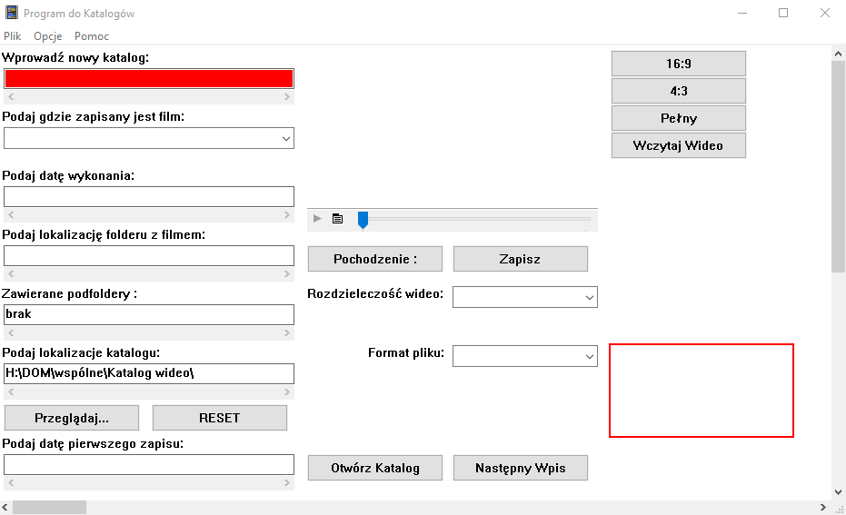
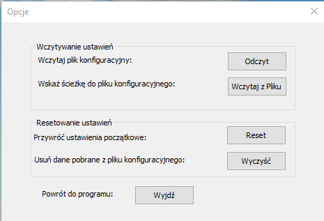
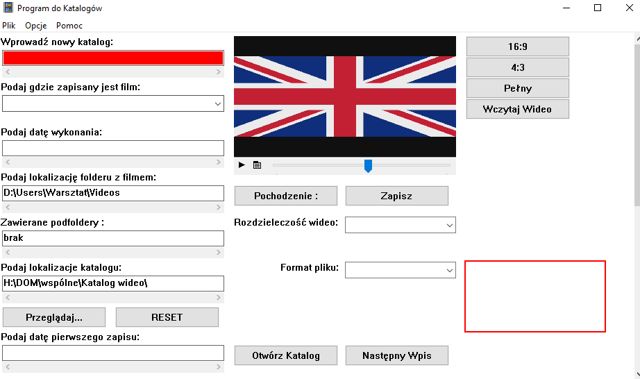

# Video-Catalog-WinAPI
My archieve (from 2018 year) program for manage wideo files on my computers. This program I've made in C++ and WinAPI.

Photo:
* Main window:

* Option window:

* Inbuild player:

